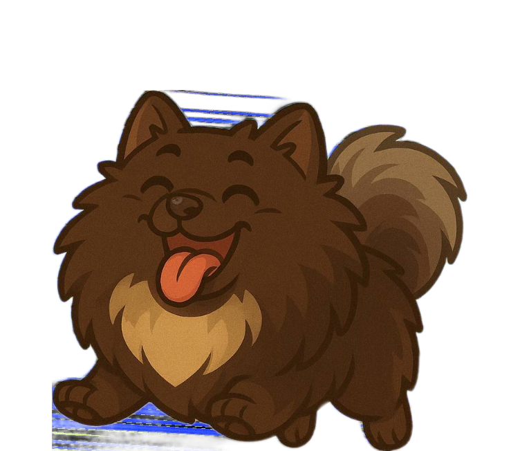
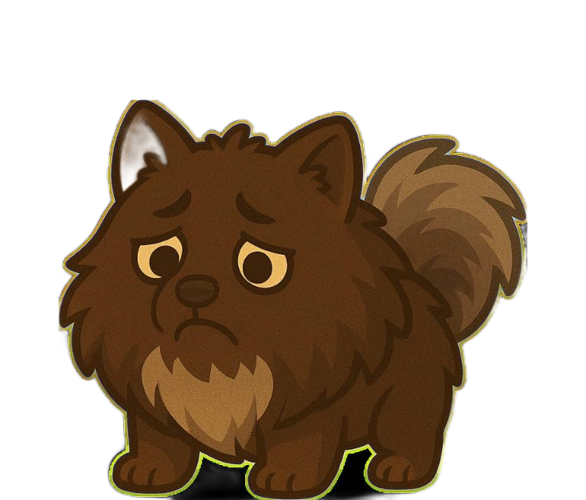

# 🎮 Godzi Game (Годзи Шпиц)

Небольшая браузерная мини-игра: ловите лакомства шпицем Годзи, зарабатывайте **годзикойны** и не теряйте жизни.

Проект состоит из:
- фронтенда на `HTML + Canvas + JS`;
- Telegram-бота на `aiogram`, который открывает игру как Telegram Mini App;
- встроенного `aiohttp`-сервера для раздачи игры и ассетов.

---

## 🕹️ Геймплей

- Управление мышью (desktop) или пальцем (touch).
- Ловите падающие лакомства — за каждое +1 к счёту.
- Если пропустили лакомство, теряется жизнь.
- После потери всех жизней игра заканчивается.
- Есть кнопка паузы и кнопка перезапуска после `Game Over`.

---

## 📸 Скриншоты

> Ниже — ключевые игровые экраны и ассеты, используемые в интерфейсе.

### Главный герой





### Игровые ассеты


---

## 🚀 Быстрый старт

### Вариант 1: запустить только игру локально (без Telegram-бота)

Если хотите просто открыть игру в браузере:

1. Запустите любой статический сервер в корне проекта, например:
   ```bash
   python3 -m http.server 8080
   ```
2. Откройте в браузере:
   ```
   http://localhost:8080/index.html
   ```

### Вариант 2: полный запуск с Telegram-ботом

1. Установите зависимости:
   ```bash
   pip install -r requirements.txt
   ```
2. Задайте переменные окружения:
   ```bash
   export BOT_TOKEN="<токен_бота>"
   export APP_URL="https://<ваш-домен>"
   # Опционально:
   export APP_VERSION="dev"
   export PORT="10000"
   ```
3. Запустите бота:
   ```bash
   python3 bot.py
   ```

---

## ⚙️ Переменные окружения

| Переменная | Обязательная | Описание |
|---|---|---|
| `BOT_TOKEN` | Да | Токен Telegram-бота |
| `APP_URL` | Да | Публичный URL приложения (без завершающего `/`) |
| `APP_VERSION` | Нет | Версия ассетов для cache-busting |
| `PORT` | Нет | Порт веб-сервера (по умолчанию `10000`) |

Если `APP_VERSION` не задана, используется `RENDER_GIT_COMMIT` или текущее время.

---

## 🧱 Структура проекта

```text
.
├── bot.py              # Telegram-бот + aiohttp-сервер
├── index.html          # Canvas-игра
├── music.mp3           # Фоновая музыка
├── requirements.txt    # Python-зависимости
└── images/             # Игровые изображения
```

---

## 🔧 Технологии

- **Frontend:** HTML5 Canvas, Vanilla JavaScript
- **Backend:** Python, aiohttp
- **Telegram:** aiogram (Mini App через `WebAppInfo`)

---

## 📌 Примечания

- В `bot.py` настроено отключение кэша ответов, чтобы игроки быстрее получали актуальную версию.
- В ссылках на ассеты добавляется параметр версии (`?v=...`) для корректного обновления файлов у клиентов.

